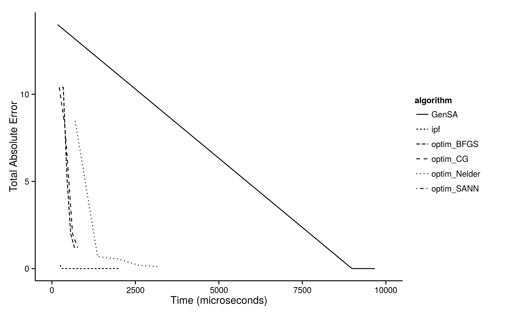

# Alternative approaches to population synthesis {#alternative-reweighting}

```{r, echo=FALSE}
# TODO: Something on urbansim?
library(png)
library(grid)
load("cache-smsim-in-R.RData")
```

This chapter briefly describes other techniques for spatial microsimulation.
We have different methods, each corresponding to a section: 

- *GREGWT* (\@ref(GREGWT)) contains a method based on a Generalized Regression Weighting 
procedure.
- *Population synthesis as an optimization problem* (\@ref(asOptim)) explains
how we can make spatial microsimulation thanks to optimization algorithms.
- *simPop* (\@ref(SimPop)) mentions another package to make spatial microsimulation.
- *The Urban Data Science Toolkit (UDST)* (\@ref(UDST)) shortly describes another
technique, coded in python.

## GREGWT {#GREGWT}

As described in the Introduction, IPF is just one strategy for obtaining a
spatial microdataset. However, researchers tend to select one method that they
are comfortable with and stick with that for their models. This is understandable
because setting up the method is usually time consuming: most researchers
rightly focus on applying the methods to the real world rather than fretting
about the details. On the other hand, if alternative methods work better for a
particular application, resistance to change can result in poor model fit. In
the case of very large datasets, spatial microsimulation may not be possible
unless certain methods, optimised to deal with large datasets, are used. Above
all, there is no consensus about which methods are 'best' for different
applications, so it is worth experimenting to identify which method is most
suitable for each application.

An interesting alternative to IPF method is the GREGWT algorithm.  First
implemented in the SAS language by the Statistical Service area of the
Australian Bureau of Statistics (ABS), the algorithm reweighs a set of initial
weights using a Generalized Regression Weighting procedure (hence the name
GREGWT).  The resulting weights ensure that, when aggregated, the individuals
selected for each small area fit the constraint variables. Like IPF, the GREGWT
results in non-integer weights, meaning some kind of integerisation algorithm
will be needed to obtain individual level microdata. For example,
if the output is to be used in ABM, the macro developed by ABS adds a weight
restriction in their GREGWT macros to ensure positive weights. The ABS uses the
Linear Truncated Method described in Singh and Mohl (1996) to enforce these
restrictions.
\index{GREGWT}

```{r, echo=FALSE}
# A problem with this
# approach is that the geneated weights produced by GREG do not have any
# restrictions, this leads to the generation of negative weights.
```

A simplified version of this algorithm (and other algorithms) is provided
by @Rahman2009.  The algorithm is described in more detail in @Tanton2011.
An R implementation of GREGWT can be found in the GitHub repository
[GREGWT](https://github.com/emunozh/GREGWT) and installed using
the function `install_github()` from the **devtools** package.

The code below
uses this implementation of the GREGWT algorithm, with the data from
Chapter 3.

```{r, fig.cap="Load and prepare the data.", message=FALSE}
# Install GREGWT (uncomment/alter as appropriate)
# devtools::install_github("emunozh/GREGWT")
# load the library (0.7.3)
library('GREGWT')

# Load the data from csv files stored under data
age = read.csv("data/SimpleWorld/age.csv")
sex = read.csv("data/SimpleWorld/sex.csv")
ind = read.csv("data/SimpleWorld/ind-full.csv")
# Make categories for age
ind$age <- cut(ind$age, breaks=c(0, 49, Inf),
               labels = c("a0.49", "a.50."))
# Add initial weights to survey
ind$w <- vector(mode = "numeric", length=dim(ind)[1]) + 1

# prepare simulation data using GREGWT::prepareData
data_in <- prepareData(cbind(age, sex),
                  ind, census_area_id = F, breaks = c(2))

# prepare a data.frame to store the result
fweights <- NULL
Result <- as.data.frame(matrix(NA, ncol=3, nrow=dim(age)[1]))
names(Result) <- c("area", "income", "cap.income")
```

The code presented above loads the SimpleWorld data and creates a new
data.frame with this data. Version 1.4 of the R library requires the data to be
in binary form. The require input for the R function is `X` representing the
individual level survey, `dx` representing the initial weights of the survey
and `Tx` representing the small area benchmarks. 

```{r, fig.cap="Load and prepare the data.", eval=FALSE, message=FALSE}
# Warning: test code
# loop through simlaton areas
for(area in seq(dim(age)[1])){
    gregwt = GREGWT(data_in = data_in, area_code = area)
    fw <- gregwt$final_weights
    fweights <- c(fweights, fw)
    ## Estimate income
    sum.income <- sum(fw * ind$income)
    cap.income <- sum(fw * ind$income / sum(fw))
    Result[area,] <- c(area, sum.income, cap.income)
}
```

In the last step we transform the vector into a matrix and see the results from
the reweighing process. 

## Population synthesis as an optimization problem {#asOptim}

\index{optimisation}
In general terms, an *optimization problem* consists of a function,
the result of which must be minimised or maximised, called an *objective function*. This function is not necessarily defined 
for the entire domain of possible inputs. The domain where this function is defined is called
the *solution space* (or the *feasible space* in formal mathematics).
Moreover, optimization problems can be *unconstrained* or *constrained*, by
limits on the values that arguments (or that a function of the arguments) of the function can take
([Boyd 2004](http://stanford.edu/~boyd/cvxbook/)). If there are constraints, the solution space could
include only a part of the image of the objective function. The objective function and the constraints 
are both necessary to define the
solution space. Under this framework,
population synthesis can be seen as a *constrained optimisation* problem.
Suppose $x$ is a vector of length $n$ $(x_1,x_2,..,x_n)$ whose values are to be adjusted. In this case
the value of the objective function is $f_0(x)$, depends on $x$. The possible values of $x$ are defined
thanks to *par*, a vector of predefined arguments or parameters of length $m$ ($m$ is the number of constraints)
($par_1,par_2,..,par_m$). 
This
kind of problem can be expressed as:

$$\left\{
\begin{array}{l}
  min \hspace{0.2cm}f_0(x_1,x_2,..,x_n) \\
  \\
  s.c. \hspace{0.2cm} f_i(x) \geq par_i,\  i = 1, ..., m
\end{array}
\right.$$

Applying this to the problem of population synthesis,
the parameters $par_i$ represent 0 and $f_i(x)=x$, since all cells have to be positive.
The $f_0(x)$ to be minimised is the distance between the actual weight matrix and
the aggregate constraint variable
`cons`. $x$ represents the weights which will
be calculated to minimise $f_0(x)$.

To illustrate the concept further, consider the case of aircraft design.
Imagine that the aim (the objective function) is to minimise
weight by changing its shape and materials. But these modifications
must proceed subject to some constraints, because the
airplane must be safe and sufficiently voluminous to 
transport people. Constrained optimisation in this case would involve
searching combinations of shape and material (to include in $x$) that minimise
the weight (the result of $f_0$, is a single value depending on $x$). This search
must take place under constraints relating to
volume (depending on the shape) and safety
($par_1$ and $par_2$ in the above notation). Thus $par$ values
define the domain of the *solution space*. We search inside this domain for
the combination of $x_i$ that minimises weight.

The case of spatial microsimulation has relatively
simple constraints: all weights must be positive or zero:

$$
\left\{ weight_{ij} \in \mathbb{R}^+  \cup \{0\} \hspace{0.5cm} \forall i,j \right\}
$$

\index{optimisation!constrained}
Seeing spatial microsimulation as an optimisation problem
allows solutions to be found using established
techniques of *constrained optimisation*.
The main advantage of this reframing
is that it allows any optimisation algorithm to perform the reweighting.

To see population synthesis as a constrained optimization problem analogous to
aircraft design, we must define the problem to optimise the variable $x$ and then
set the constraints.  

Intuitively, the weight (or number of occurrences) for each individual
should be the one that best fits the constraints. We could take
the weight matrix as $x$ and as the objective function the difference between the 
population with this weight matrix and the constraint. However, we want to include
the information of the distribution of the sample. 
We must find a vector `w` with which to multiply the `indu` matrix.
`indu` is similar to `ind_cat`, but each row of `ind_cat` represents an individual of the sample,
whereas each row of `indu` concerns a type of individual.
This means that if 2 people in the sample have the
same characteristics, the corresponding line in `indu` will appear only once. The cells of `indu` contain
the number of times that this kind of individual appears in the sample. The result
of this multiplication should be as close as possible to the constraints.

When running the IPF procedure zone-by-zone using this method, the
optimization problem for the first zone can be written as follows:

$$\left\{
\begin{array}{l}
  min \hspace{0.2cm} f(w_1,..,w_m) = DIST(sim, cons[1,]) \\
  \hspace{0.8cm} where  \hspace{0.2cm} sim=colSums(indu * w)\\
  \\
  s.c. \hspace{0.2cm} w_i \geq 0,\  i = 1, ..., m
\end{array}
\right.$$

Key to this is interpreting individual weights as parameters (the vector $w=(w_1,...,w_m)$,
of length $m$ above)
that are iteratively modified to optimise the fit between individual and
aggregate level data. Note that in comparison with the theoretical 
definition of an optimisation problem, our parameters to determine (`par`) are the theoretical $x$. 
The measure of fit, so the distance, we use in this context is
Total Absolute Error (TAE).

$$\left\{
\begin{array}{l}
  min \hspace{0.2cm} f(w_1,..,w_m) = TAE(sim, cons[1,]) \\
  \hspace{0.8cm} where  \hspace{0.2cm} sim=colSums(ind\_cat * w)\\
  \\
  s.c. \hspace{0.2cm} w_i \geq 0,\  i = 1, ..., m
\end{array}
\right.$$

Note that although
the "TAE" goodness-of-fit measure was used in this example,
any could be used.


```{r, echo=FALSE}
# (MD) Compare with different metrics?
```

Note that in the above, $w$ is equivalent to the `weights` object
we have created in previous sections to represent how representative
each individual is of each zone. 

The main issue with this definition of reweighting is therefore the large
number of free parameters: equal to the number of individual level dataset.
Clearly this can be very very large. To overcome this issue,
we must 'compress' the individual level dataset to its essence, to contain
only unique individuals with respect to the constraint variables
(*constraint-unique* individuals).

The challenge is to convert the binary 'model matrix' form of the
individual level data (`ind_cat` in the previous examples) into
a new matrix (`indu`) that has fewer rows of data. Information about the
frequency of each constraint-unique individual is kept by increasing the
value of the '1' entries for each column for the replicated individuals
by the number of other individuals who share the same combination of attributes.
This may sound quite simple, so let's use the example of SimpleWorld to
illustrate the point.

### Reweighting with optim and GenSA

The base R function `optim` provides a general purpose optimization framework
for numerically solving objective functions. Based on the objective function
for spatial microsimulation described above,
we can use any general optimization algorithm for reweighting the
individual level dataset. But which to use?

Different reweighting strategies are suitable in different contexts and there
is no clear winner for every occasion. However, testing a range of
strategy makes it clear that certain algorithms are more efficient than
others for spatial microsimulation. Figure 6.1 demonstrates this variability
by plotting total absolute error as a function of number of iterations for
various optimization algorithms available from the base function
`optim` and the **GenSA** package. Note that the comparisons 
are performed only for zone 1.
\index{benchmarking}
\index{speed}

```{r, fig.cap="Relationship between number of iterations and goodness-of-fit between observed and simulated results for different optimisation algorithms.", fig.scap="Total Absolute Error results for several algorithms", fig.width=8, fig.height=8,fig.pos='!h', echo=FALSE}
# commented as pdf version looks better! 
img <- readPNG("figures/TAEOptim_GenSA_Mo.png")
grid.raster(img)
# \begin{figure}
# \includegraphics{figures/TAEOptim_GenSA_Mo.pdf}
# \caption{Relationship between number of iterations and goodness-of-fit between observed and simulated results for different optimisation algorithms.}
# \end{figure}
```


```{r, eval=FALSE, echo=FALSE}
source("code/optim-tests-SimpleWorld.R", echo = FALSE, print.eval = FALSE )
qplot(data = opt_res, time, fit, color = algorithm, geom="line") +
  ylab("Total Absolute Error") + xlab("Time (microseconds)") + scale_color_brewer(palette = 2, type = "qual") + theme_classic() + xlim(c(0, 15000))
```

Figure 6.1 shows that all algorithms
improve fit during the first iteration.
The reason for using IPF
becomes clear after only one iteration.
On the other end of the spectrum is R's default optimization algorithm,
the Nelder-Mead method, which requires many more iterations to
converge to a value approximating zero than does
IPF.^[Although
the graph shows no improvement
from one iteration to the next for the Nelder-Mead algorithm,
it should be stated that it
is just 'warming up' at this stage and than each iteration is very
fast, as we shall see. After 400 iterations (which happen
in the same time that other algorithms take for a single iteration!),
the Nelder-Mead begins to converge: it works
effectively.]
Next best in terms of iterations is `GenSA`, the Generalized Simulated
Annealing Function from the **GenSA** package. `GenSA`
attained a near-perfect fit after only two full iterations.

\pagebreak

The remaining algorithms shown are, like Nelder-Mead, available from within R's
default optimisation function `optim`. The implementations with `method =` set
to `"BFGS"` (short for the Broyden–Fletcher–Goldfarb–Shanno algorithm),
`"CG"` ('conjugate gradients') performed roughly the same, steadily approaching
zero error and fitting to `"IPF"` and `"GenSA"` after 10 iterations. Finally, the `SANN` method
(a variant of a Simulated ANNealing),
also available in `optim`, performed most erratically of the methods tested.
This is another implementation of simulated annealing which demonstrates that
optimisation functions that depend on random numbers do not always lead to
improved fit from one iteration to the next. If we look until 200 iterations, 
the fit will continue to oscillate and not be improved at all.

The code used to test these alternative methods for reweighting are provided
in the script 'code/optim-tests-SimpleWorld.R'. The results
should be reproducible on
any computer, provided the book's supplementary materials have been downloaded.
There are many other optimisation algorithms available in R through a wide
range of packages and new and improved functions are being made available all the time.
Enthusiastic readers are encouraged to experiment with the methods presented here:
it is possible that an algorithm exists which outperforms all of
those tested for this book. Also, it should be noted that the algorithms
were tested on the extremely simple and rather contrived example dataset
of SimpleWorld. Some algorithms may perform better with larger datasets than others
and may be sensitive to changes to the initial conditions
such as the problem of 'empty cells'.

```{r, echo=FALSE}
# TODO: cite performance testing paper here
```

Therefore these results, as with any modelling exercise,
should be interpreted with a healthy dose of skepticism: just because an
algorithm converges after few 'iterations' this does not mean it is
inherently faster or more useful than another. The results are context
specific, so it is recommended that the tested framework
in 'code/optim-tests-SimpleWorld.R' is used as a basis for further tests
on algorithm performance on the datasets you are using.
IPF has performed well in the situations I have tested it in (especially
via the `ipfp` function, which performs disproportionately faster
than the pure R implementation on large datasets) but this does not mean
that it is always the best approach.

To overcome the caveat that the meaning of an 'iteration' changes dramatically
from one algorithm to the next, further tests measured the time taken
for each reweighting algorithm to run. To have a readable graph, we 
do not represent the error as a function of the time, but the time per
algorithm in function of the number of iterations (Figure 6.2). This figure
demonstrates that an iteration of GenSA take a long time in comparison 
with the other algorithm. Moreover, `"BFGS"` and `"CG"` are still following a
similar curve under GenSA. Nelder-Mead, SANN and IPF contains iterations that 
take less time. By observing Figures 6.1 and 6.2 simultaneously , it appears that IPF is the best 
in terms of convergence (little TAE after few iterations)
and the time needed for few iterations is good.

```{r, fig.cap="Relationship between processing time and goodness-of-fit between observed and simulated results for different optimisation algorithms", fig.scap="Relationship between processing time and goodness-of-fit", fig.width=4, fig.height=4, echo=FALSE}
# img <- readPNG("figures/TimeOptim_GenSA_Mo.png")
# grid.raster(img)
# # 
```

```{r, fig.cap="Relationship between processing time and goodness-of-fit between observed and simulated results for different optimisation algorithms.", fig.width=8, fig.pos='!h', echo=FALSE}
img <- readPNG("figures/TimeOptim_GenSA_Mo.png")
grid.raster(img)
```


\pagebreak

Nelder-Mead is fast at reaching a good
approximation of the constraint data, despite taking many iterations.
`GenSA`, on the other hand, is shown to be much slower than the others,
despite only requiring 2 iterations to arrive at a good level of fit.

Note that these results are biased by the example that is pretty small 
and runs only for the first zone.

### Combinatorial optimisation

\index{combinatorial optimisation}
Combinatorial optimisation (CO) is a set of methods for
solving optimisation problems from a discrete range of options.
Instead of allocating weights to individuals per zone,
combinatorial optimisation identifies a set
of feasible candidates to 'fill' the zone
and then swaps in new individuals. The objective
function to be minimised is used to decide if the swap was beneficial or not.
There are many combinatorial optimisation methods available. Which is suitable
depends on how we choose the combination of candidates and how we determine
what happened after evaluation.

CO is an alternative to IPF for allocating individuals
to zones. This strategy is probabilistic
and results in integer weights (since it is a combination of individuals).
Combinatorial optimisation
may be more appropriate for applications where input individual microdatasets are 
very large: the speed benefits of using the deterministic IPF algorithm shrink as 
the size of the survey dataset increases. As seen before, IPF creates non integer 
weights, but we have proposed two solutions to transform them into the final 
individual level population. So, the proportionality of IPF is more intuitive,
but need to calculate the whole weight matrix at each iteration, where CO
just proposes candidates. If the objective function takes a long time
to be calculated CO can be computationally intensive because the
goodness-of-fit must be evaluated each time a new 
population is proposed with one or several swapped individuals.

\index{genetic algorithm}
Genetic algorithms are included in this field and become popular in some 
domains, such as industry, for the moment. This kind of algorithm can be 
very effective when the objective function has several local minima and
we want to find the global one
(Hermes and Poulsen, 2012).

```{r, echo=FALSE}
# No sure this section is useful; removed for now...
# 
# There are two approaches for reweighting using combinatorial optimisation
# in R: shuffling individuals in and out of each area and combinatorial optimisation,
# the *domain* of the solution space set to allow integer-only results.
# 
# The second approach to combinatorial optimisation in R depends on methods
# that allow only integer solutions to the general constrained optimisation
# formulae demonstrated in the previous section. *Integer programming* is the
# branch of computer science dedicated to this area, and it is associated with
# its own algorithms and approaches, some of which have been implemented in R
# (Zubizarreta, 2012).
```


To illustrate how the integer-based
approach works in general terms, we can use the
`data.type.int` argument of the `genoud` function in the **rgenoud** package.
This ensures only integers result from the optimisation process:

```{r, eval=FALSE}
# Set min and maximum values of constraints with 'Domains'
m <- matrix(c(0, 100), ncol = 2)[rep(1, nrow(ind)),]
set.seed(2014)
genoud(nrow(ind), fn = fun, ind_num = ind, con = cons[1,],
  control = list(maxit = 1000), data.type.int = TRUE, D = m)
```

This command, implemented in the file 'code/optim-tests-SimpleWorld.R',
results in weights for the unique individuals 1 to 4 of 1, 4, 2 and 4 respectively.
This means a final population with aggregated data equal to the target
(as seen in the previous section):


```{r, echo=FALSE}
umat_count <- function(x) {
 xp <- apply(x, 1, paste0, collapse = "") # "pasted" version of constraints
 freq <- table(xp) # frequency of occurence of each individual
 xu <- unique(x) # save only unique individuals
 rns <- as.integer(row.names(xu)) # save the row names of unique values of ind
 xpu <- xp[rns]
 o <- order(xpu, decreasing = TRUE) # the order of the output (to rectify table)
 cbind(xu, data.frame(ind_num = freq[o], rns = rns)) # outputs
}

umat <- umat_count(ind_cat)
indu <- apply(umat[1:ncol(ind_cat)], 2, function(x) x * umat$ind_num.Freq)
```


```{r, echo=FALSE}
colSums(indu * c(1, 4, 2, 4))
```

Note that we performed the test only for zone 1 and the aggregated
results are correct for the first constraint. Moreover, 
thanks to the fact that the algorithm only considers
integer weights, we do not have the issue of fractional weights
associated with IPF.
Combinatorial optimisation algorithms for population
synthesis do not rely on integerisation,
which can damage model fit. The fact that the gradient contains "NA"^[We mean that instead of having a numerical value in each cells, some cells contain the value 'NA'(Non Applicable). This value appears when this cell has not been defined.]
in the end of the algorithm is not a problem, because it just means
that this cell has not been calculated.

```{r, echo=FALSE}
# Not entirely sure what is meant by "the gradient contains "NA""
# Please explain! (RL)
```

Note that there can be several solutions which attain
a perfect fit. This result depends on the random seed chosen for
the random draw. Indeed, if we chose a seed of 0
(by writing `set.seed(0)`), as before, we obtain the weights 
`(0, 6, 4, 2)` which results also in a perfect fit for zone 1.
These two potential synthetic populations reach a perfect fit, but 
are quite different. Indeed, we can observe the two populations.

```{r, include=FALSE}
colSums(indu * c(0 ,6 ,4 ,2))
```

```{r, include=FALSE}
indu * c(1 ,4 ,2 ,4)
indu * c(0 ,6 ,4 ,2)
```

\pagebreak
An example of comparison is that the second proposition contains 
no male being more than 50 years old, but the first one has 2.
With this method, there cannot be a population with 1 male of
over 50, because we take integer weights and there are two 
men in this category in the sample. This is the disadvantage of
algorithms reaching directly integer weights. With IPF, if the 
weights of this individual are between 0 and 1, there is a possibility 
of a person belonging to this category.

`genoud` is used here only
to provide a practical demonstration of the possibilities of
combinatorial optimisation using existing R packages.

For combinatorial optimisation algorithms designed for spatial microsimulation
we must, for now, look for programs outside the R 'ecosystem'.
Harland (2013) provides a practical tutorial
introducing the subject using the Java-based
Flexible Modelling Framework (FMF).
\index{Java}
\index{flexible modelling framework (FMF)}

## simPop {#SimPop}

\index{EU-SILC}
The **simPop** package provides alternative methods for
generating and modelling synthetic microdata.
A useful feature of the package is its inclusion of
example data. Datasets from the 'EU-SILC'
database (EU statistics on income and living conditions)
and the developing world are included to demonstrate the methods.

An example of the individual level data provided by the package,
and the function `contingencyWt`, is demonstrated below.

```{r, message=FALSE}
# install.packages("simPop")
library(simPop)

# Load individual level data
data("eusilcS")
head(eusilcS)[2:8]

# Compute contingency coefficient between two variables
contingencyWt(eusilcS$pl030, eusilcS$pb220a,
  weights = eusilcS$rb050)
```

\index{simPop}

The above code shows the first 8 (of 18) variables in the `eusilcS` dataset
provided by **simPop** and an example of one of **simPop**'s functions.
This function is useful, as it calculates the level of association between
two categorical variables: economic status (`pl030`) and citizenship status
(`pb220a`). The result of 0.175 shows that there is a weak association between
the two variables.
**simPop** is a new package so we have not covered it in detail. However,
it is worth considering for its provision of example datasets alone.

Note that this package provides several alternative methods for population
synthesis, including "model-based methods,
calibration and combinatorial optimization algorithms" 
[@simPop].

## The Urban Data Science Toolkit (UDST) {#UDST}

The UDST provides an even more ambitious approach to modelling
cities that contains a population synthesis component.
An online overview of the project - http://www.udst.org/ -
shows that the developers of the UDST are interested in visualisation
and modelling, not just population synthesis. The project is an
evolving open source project hosted on GitHub.
It is outside the scope of this book to comment on the performance
of the tools within the UDST (which is written in Python). Suffice
to flag the project and suggest readers investigate the
[Synthpop](https://github.com/UDST/synthpop)
software as an alternative synthetic population generator.

\index{Synthpop}
\index{Urban Data Science Toolkit}

## Chapter summary

In summary, this chapter presented several alternatives to IPF
to generate spatial microdata. We explored a regression
method (GREGWT), combinatorial optimization and the R package
*simPop*. Finally we looked at the Python-based Urban Data Science Toolkit.
