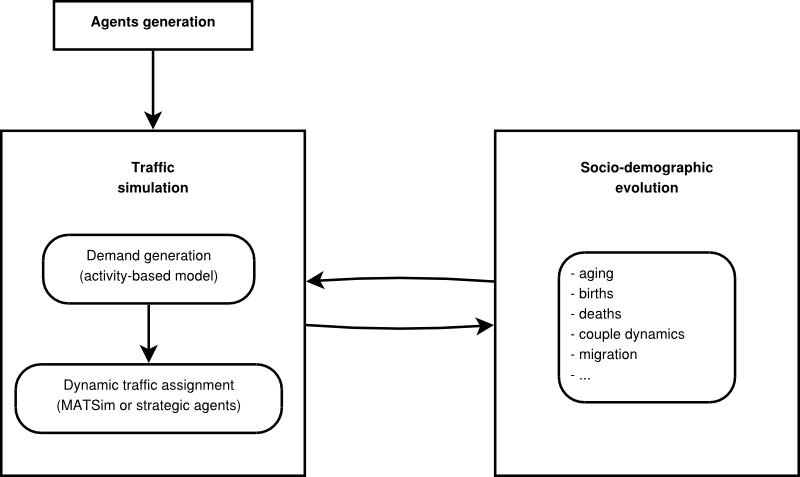
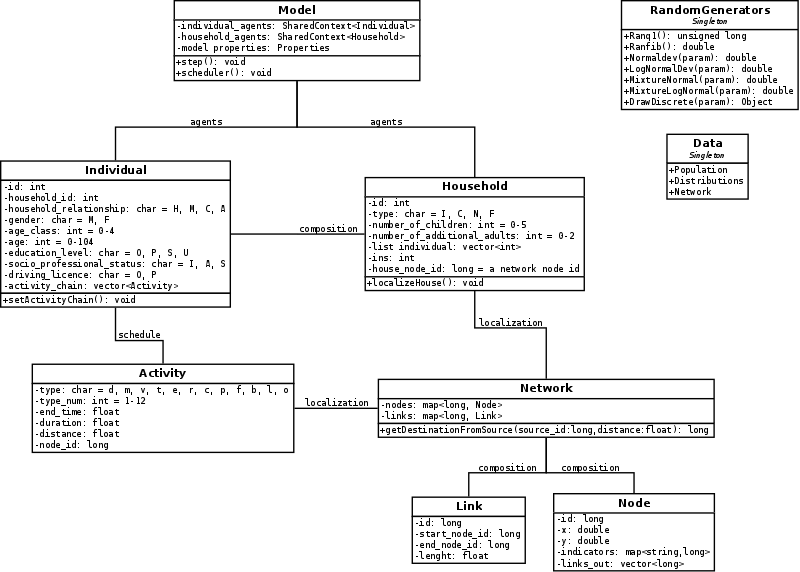

```{r setup, include=FALSE}
knitr::opts_chunk$set(echo = FALSE)
```

## What is an Agent-based model?

It consists of :

> - Agents with characteristics (Agents Are Autonomous Decision-making Units with Diverse Characteristics (Heterogeneous));
> - their environment;
> - relations between agents;
> - AND possibly relations between the agents and their environment.


##

"Agent-based modelling can find new, better solutions to many
problems important to our environment, health, and economy" (Grimm and Railsback 2011)


##

An ABM can evolve through time and space, but need as input 

> - the complete population, 
> - with the pertinent characteristics for each person,
> - localized in their environment,
> - the definition of the differents relations.

##

The individual level data needed can be generated thanks to a spatial microsimulation.

## Examples of developped agent-based models

> - NetLogo [@thiele_facilitating_2014]
> - VirtualBelgium [@barthelemy_stochastic_2015]
> - TransMob [@TransMob]

##

NetLogo for Simpleworld: At each *time tick* the inhabitants will:

> 1. move to a random location within their zone.
> 2. "look across the fence": check their field of vision for inhabitants from a neighbouring zone and select the closest one in view.
> 3. try to "convince" them to come over to the other side: the inhabitant with more money (`income`) will *bribe* the other with 10% of their money to come over to their zone.

The model will have the following adjustable parameters:

> 1. The field of vision has two parameters: the viewing angle and the distance
> 2. Average level of *bribeability* of inhabitants: if their level is less than 100%, a random number generator will be used to determine whether the agent accepts the bribe or not. The distribution of bribeability is approximately normal with a mean and a standard deviation.

##


\includegraphics[width=0.9\textwidth]{../figures/nl-plots.png}

##
VirtualBelgium



##



## 
Need of spatial microsimulation:

- To create the initial individuals;
- To have the household features;
- To assign an activity to each person.

## 
If you want to create your own code for ABM, think of :

- Object oriented programming (such as C++)
- Repast (https://repast.github.io/index.html)

##
If your aim is to make an ABM and you have not enough input data, you can generate a spatial microsimulation.

But, first you need to be sure of what will be needed.

[A good introduction to agent-based modelling](http://link.springer.com/article/10.1057/jos.2010.3)

An example of a combination of spatial microsimulation and agent based modelling : Virtual Belgium In Health

## References


