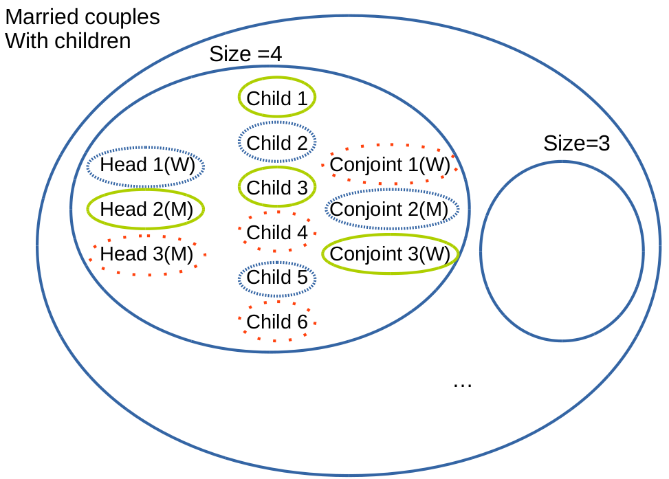
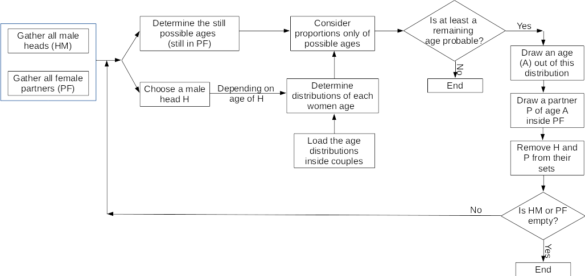

```{r setup, include=FALSE}
knitr::opts_chunk$set(echo = FALSE)
```

## Without microdata?

If you have no microdata, but you would like to generate a microsimulation, you can use a wide range of methods, depending on the data you have.

For example:

> - Global cross-tables and local marginal distributions 

> - Two level aggregated data 

> - Only a cross-table, but also mean, standard deviation,... of the caracteristics you would like to add

## Global cross-tables and local marginal distributions 

The global cross-table can be the initial weight matrix. 

Or, thanks to *mipfp* it can be the initial matrix AND a constraint.

## Two level aggregated data 

For example (Barthélemy and Toint - 2013): 

At municipality level: 

>  - the cross table gender x age 
>  - and the marginals of diploma level and activity status;
          
          
          
At district level: 

>  - gender x activity status, 
>  - gender x diploma level, 
>  - age x activity status 
>  - and age x diploma level.

## Several steps

> 1. Create at district level gender x activity status x age 
> 2. Create at district level gender x diploma level x age 
> 3. Create at district level gender x activity status x age x diploma level
> 4. Use this data as seed for IPF and the two municipality level databases as constraints


## Only a cross-table, but also mean, standard deviation,...

First, created the constraints by knowing:

- the distribution of you variable
- the total number of individuals you need at the end.


## Addition of the household level 

Depending on the data you have, they are several possibilities. One method is :

> - Run a IPF to create an individual pool.
> - Run a IPF to create an household pool.
> - Try to complete the household with individuals (depending on the variable of both)

##

If you have more precise data, such as age differences in couples, type of household of each individual, their civil status, ... you can make a combinatorial optimization to constraint the households.

In the case of my current research, the data are: 

> - for each individual, a zone, age, sex, some characteristics AND size and type of household;
> - the age distribution between couples and between mother and child;

##



##



##

[@lenormand_generating_2012]
https://arxiv.org/pdf/1208.6403v2.pdf

IPU (Guo and Bhat, 2007)

## Choice of data and methods 

> - Major tip : first 'make a plan' before beginning to code.
> - Checking the source of the data and the way it was collected.
> - Does it represent your target data?
> - Choice of method is important. What are the hypothesis of the method? The underlying assumptions? What are the strengths and weaknesses of the method?
> - Spatial microsimulation is an approximation, so you need to be aware of the biais that the method could have. 

## Coding

Imagine that the aim is to create a population for a Belgian province (Namur) characterised by: 

> - A municipality (code INS),
> - a diploma level,
> - a professional status level,
> - an age category (0.5 meaning from 0 to 5 years old),
> - a gender.

##
The data you have are stored in the *Belgium* folder. You have : 

> - ContrainteStatut.txt: per municipality and professional status, you have a count;
> - ContrainteGenre.txt: per municipality and gender, you have a count;
> - ContrainteDipl.txt: per municipality and diploma level, you have a count;
> - ContrainteAge.txt: per municipality and age classes, you have a count;
> - BelgiqueConting.txt : per age classes, gender, diploma and status, you have a count.


## References
