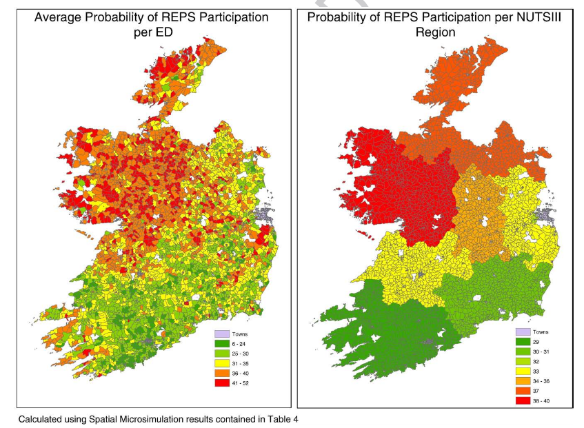
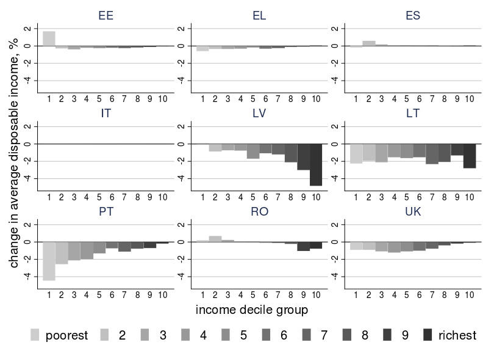

```{r setup, include=FALSE}
knitr::opts_chunk$set(echo = TRUE)

```

## Introduction

- Housekeeping
- About the course and its teachers
- Lectures and practicals
- Getting help

## Housekeeping

- Thanks to the hosts, the JRC

## Spatial Microsimulation with R

Aims:

1. To provide a solid understanding of the method and applications
2. To teach its implementation in R in general terms
3. To provide guidance on next steps

## Objectives:

- Become proficient with R and RStudio for handling data
- Understand some applications where spatial microsimulation is useful
- Realise the limitations of the method
- Know about a range of packages for doing spatial microsimulation with R
- Understand code for generating spatial microdata with **mipfp**
- Have ideas for trying the methods on your own datasets

# About the course and its teachers

## The request to teach at the EU

- Links with much of the research taking place at the JRC
- Big Data
- Modelling
- Social impact assessment
- Scenarios of the future

## The course materials

- Based on our book, [@lovelace_spatial_2016]. Digital versions available on-line
- Slides available on-line
- We'll be making small 'code chunks' and scripts available during the course
- Any feedback welcome

## A bit about us

Robin Lovelace

> - Environmental Geographer turned Computational and Transport Geographer
> - Now on 5 year University Academic Fellowship (UAF) in Transport and Big Data at Leeds Institute for Transport Studies (ITS)
> - Creator of many online teaching materials - see [github.com/robinlovelace](https://github.com/Robinlovelace)
> - Creator of the [**stplanr**](https://github.com/ropensci/stplanr) package
> - Lead developer of the [Propensity to Cycle Tool](http://www.pct.bike/) (PCT)

## A bit about us

Morgane Dumont

> - Applied Mathematician with coding, algorithmic and statistics background
> - Now on a project of the Wallonia Region developping an evolutionary spatial microsimulation to forecast health needs of elderly in 2030 for Belgium
> - Teach statistics in R to the master's student in applied mathematics at university of Namur


## A bit about you

- Go-around - who you are, interests in the course
- With your neighbour:

    > - Experience with R
    > - Geographical data

- What you hope to get out of the course

# What is spatial microsimulation and its applications

## What is spatial microsimulation?

1. A method
2. An approach

## Applications

- Wide variety of potential applications
- So far main applications have been in health, poverty mapping and transport
- What do you want to use spatial microsimulation for?
- @tomintz_geography_2008 The geography of smoking in Leeds: estimating individual smoking rates and the implications for the location of stop smoking services. 
- Exploration of the energy costs of transport [@lovelace_oil_2014]

## Agriculture

@hynes_modelling_2008 is a classic example

Had 2 datasets:

- Individual level data on farmers participating in agri-environment scheme
- Farm level data with many attributes about the farms
- Geographical data on farms at the Enumeration District (ED) level

For confidentiallity reasons, the individual-level datasets could not be linked

Spatial microsimulation used to create a synthetic dataset

## Agriculture II

Results show the probability of participation across Ireland:



## Tax policy

Commonly used to evaluate distributional impacts of tax policies [@agostini_were_2014]



## Transport

A simulation of the car's traffic for Namur [@barthelemy_parallelized_2014]

\includegraphics[width=0.5\textwidth]{../figures/Trafic_jojo.png}
\includegraphics[width=0.5\textwidth]{../figures/Trafic_Jojo2.png}


Used tools : spatial microsimulation, agent based modelling, activity chains,...

## What's next:

  - The RStudio Graphical User Interface (GUI)
  - Using R
  - Project management
  - GitHub
  
## References