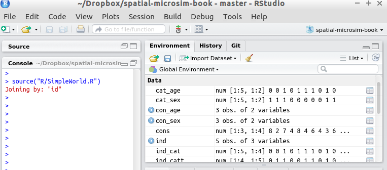
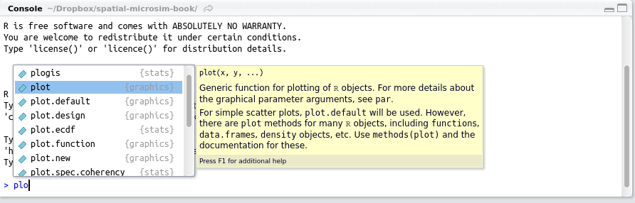

```{r setup, include=FALSE}
knitr::opts_chunk$set(echo = TRUE)
knitr::opts_knit$set(root.dir = "..")
```

## Introduction

- Primarily a practical session
- Based on the [old](https://en.wikipedia.org/wiki/Docendo_discimus) (~2000 years old!) saying *docendo discimus*:

> **by teaching we learn**.

We'll use up-to-date materials:
  - A section from [Efficient R Programming](https://csgillespie.github.io/efficientR/set-up.html#rstudio)
  - And a live demo

## Practical demonstration using R and RStudio

- Using the simpleworld data

```{r}
source("code/SimpleWorld.R")
```

## Loading data

```{r}
con_age <- read.csv("data/SimpleWorld/age.csv")
con_sex <- read.csv("data/SimpleWorld/sex.csv")
```

- R can read data from all major file-formats
- See the **rio** package for more information

```{r, eval=FALSE}
install.packages("rio")
```

## Subsetting data

```{r}
con_age
```


```{r, eval=FALSE}
View(con_age)
```

## Exploring RStudio



## Autocompletion



## Exercises

Work through [Section 2.5 of Efficient R Programming](https://csgillespie.github.io/efficientR/set-up.html#rstudio)

- Answer the practicals.
- If you finish early, work on the Spatial Microsimulation book's [appendix](https://github.com/Robinlovelace/spatial-microsim-book/blob/master/13-appendix.Rmd)