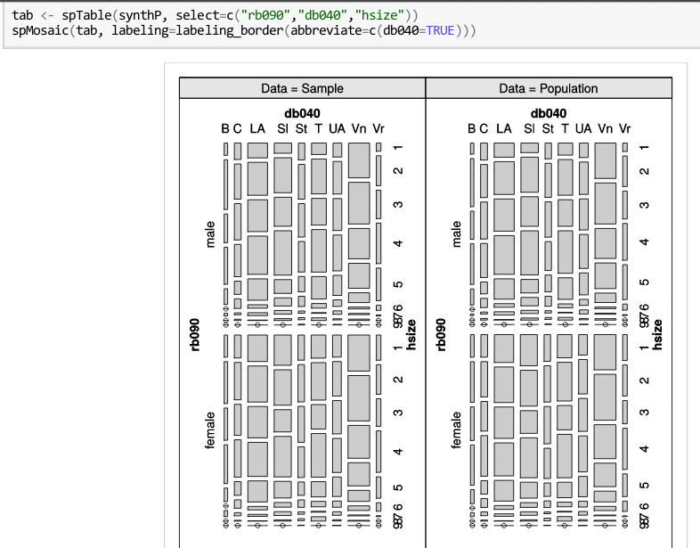

## SimPop

- simPop is a package for creating, analysing and modelling synthetic microdata
- It is powerful and integrates a number of beneficial features:
    - Parallel processing
    - Real (EU SILC and other) test datasets
    - Wide range of functionality
- Funded by respected organisations and implemented by skilled programmers

## Basic use

```{r, echo=TRUE}
library(simPop) # loads lots of packages
```

## simPop data

```{r, echo=TRUE}
data(eusilcS)
dplyr::glimpse(eusilcS[1:5])
```

## Create dataObj

```{r, echo=TRUE}
inp = specifyInput(data = eusilcS,
                   hhid = "db030",
                   hhsize = "hsize",
                   strata = "db040",
                   weight = "rb050")
class(inp)
inp
```

## Input data

```{r, echo=TRUE}
head(eusilcS$db030)
head(eusilcS$hsize)
# number of people per household
nrow(eusilcS) /
  length(unique(eusilcS$db030))
```

## Constraining the input data by cross-tabbed marginals

```{r, echo=TRUE}
data(totalsRGtab)
totalsRGtab
rcons = colSums(totalsRGtab) / sum(totalsRGtab)
rsurv = summary(eusilcS$db040) / nrow(eusilcS)
```

## Differences in regional totals

```{r, echo=TRUE}
plot(rcons)
points(rsurv, pch = 3)
text(1:length(rsurv), y = pmin(rsurv, rcons), labels = names(rcons))
```

## Add weights

```{r, echo=TRUE}
addWeights(inp) =
  calibSample(inp = inp, totals = totalsRGtab)
synthP = simStructure(dataS = inp,
                      method = "direct",
                      basicHHvars = c("age", "rb090", "db040"))
```

## A look at the outputs

```{r, echo=TRUE}
slotNames(synthP)
nrow(synthP@pop@data)
head(synthP@pop@data)
rsynth = summary(synthP@pop@data$db040) /
  nrow(synthP@pop@data)
```

## Comparison with marginals

```{r, echo=TRUE}
plot(rcons)
points(rsynth, pch = 3)
text(1:length(rsurv), y = pmin(rsurv, rcons), labels = names(rcons))
```

## Visualisation | source: [publik.tuwien.ac.at](http://publik.tuwien.ac.at/files/PubDat_238106.pdf) 



## Tasks

- Practical (30 minutes)
    - Basic: read-up on **simPop**
    - Intermediate: build on the examples using `data("eusilcP")` and `data("eusilcS")` to explore the functionality of **simPop**
    - Advanced: take a look at the package's source code
    
- Challenge (20 minutes)
    - Beginner: try to create a synthetic microdataset of [SimpleWorld](https://github.com/Robinlovelace/spatial-microsim-book/blob/master/02-SimpleWorld.Rmd) using **simPop**
    - Explore how to use `simContinuous()` to estimate mean income in the regions of Austria

- Discussion: how could these methods be useful in your work?

```{r}
args(simContinuous)
```

## simPop resources:

- Slides by Matthias Templ: http://publik.tuwien.ac.at/files/PubDat_238106.pdf
- A youtube video on the topic: https://www.youtube.com/watch?v=fjZhAUq3JZ0
- The package's documentation

