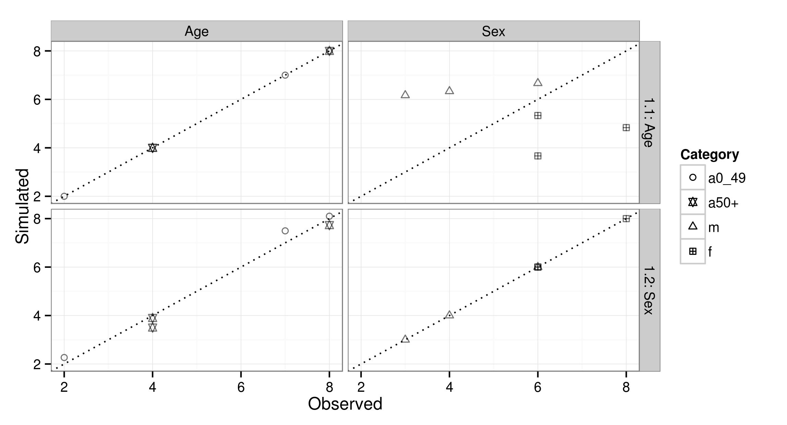

```{r setup, include=FALSE}
library(grid)
knitr::opts_chunk$set(echo = FALSE)
```

## The plan for this afternoon

- General statements on spatial microsimulation
- Reweighting procedures
- The CakeMap example
    - Context
    - Defining the target and the constraints
    - Loading the data
    - Preparing the data 
    - IPF 
- simPop

## General statements on spatial microsimulation

```{r, out.width = "340px",fig.align='center'}
knitr::include_graphics("../figures/msim-schema.png")
```

## 

The aim is to use available data (at different level of aggregation) to create a synthetic population statistically similar to the real one. 

Note that population is here the statistical term, meaning that it can be a set of objects or animals also.

Depending on the target population and the availability of data, we can use several methods and obtain different level of quality.

##
We often have two types of data: 

>  - Microdata for only a sample of the population
>  - Aggregated data of the whole population (called the *constraint*)
  
## Reweighting procedures

Having constraints (per zone) and a sample, we would like to :

  - determine the representativness of each person for each zone
  - replicate each individual the number of times that allows to respect the constraint for the zone
  - by trying at each step to keep proportions similar
  
For SimpleWorld for example, we have constraints on age and sex for each zone. Remember these data.

## 

Cross table of the sample

|sex - age| 0-49 yrs| 50 + yrs| Total|
|:-------------|-----:|-----:|-----:|
|m             |     1|     2|     3|
|f             |     1|     1|     2|
|Total         |     2|     3|      |


Constraints for zone 1:

|modality| 0-49 yrs| 50 + yrs| m | f |
|:-------------|----:|----:|----:|----:|
|Target total  |     8|     4| 6 | 6 |


##

Aim: complete this table by using IPF and the sample

sex - age  | 0-49 yrs | 50 + years | Total 
------------- | ------------- | ------------- | -------------
m  | ? | ? | 6
f  | ? | ? | 6
Total | 8 |4 | 12


## 

Initial table

|sex - age| 0-49 yrs| 50 + yrs| Total| Target total |
|:-------------|-----:|-----:|-----:|-----:|
|m             |     1|     2|     3|     6|
|f             |     1|     1|     2|     6|
|Total         |     2|     3|      |      |
|Target total  |     8|     4|      |      |

##

Iteration 1 : fit age constraints

|sex - age| 0-49 yrs| 50 + yrs| Past total| Target total |
|:-------------|-----:|-----:|-----:|-----:|
|m             |     $1*\frac{8}{2}=4$|     $2*\frac{4}{3}=2.667$|     3|     6|
|f             |     $1*\frac{8}{2}=4$|     $1*\frac{4}{3}=1.333$|     2|     6|
|Past total         |     2|     3|      |      |
|Target total  |     8|     4|      |      |

##

Iteration 1 : fit age constraints : update the totals

|sex - age| 0-49 yrs| 50 + yrs| Current total| Target total |
|:-------------|-----:|-----:|-----:|-----:|
|m             |     $1*\frac{8}{2}=4$|     $2*\frac{4}{3}=2.667$|     6.667|     6|
|f             |     $1*\frac{8}{2}=4$|     $1*\frac{4}{3}=1.333$|     5.333|     6|
|Current total         |     8|     4|      |      |
|Target total  |     8|     4|      |      |

##

Iteration 1 : fit sex constraints 

|sex - age| 0-49 yrs| 50 + yrs| Past total| Target total |
|:-------------|-----:|-----:|-----:|-----:|
|m             |     $4*?$|    $2.667*?$|     6.667|     6|
|f             |     $4*?$|    $1.333*?$|     5.333|     6|
|Past total         |     8|     4|      |      |
|Target total  |     8|     4|      |      |


## 

Iteration 1 : fit sex constraints 

|sex - age| 0-49 yrs| 50 + yrs| Current total| Target total |
|:-------------|-----:|-----:|-----:|-----:|
|m             |     $4*\frac{6}{6.667}=3.600$|    $2.667*\frac{6}{6.667}=2.400$|     6|     6|
|f             |     $4*\frac{6}{5.333}=4.500$|    $1.333*\frac{6}{5.333}=1.500$|     6|     6|
|Current total         |     8.1|     3.9|      |      |
|Target total  |     8|     4|      |      |


## Visualisation of step 1 for the 3 zones

```{r, out.width = "850px",fig.align='center'}

```


## Whole process per zone

This is how one iteration works. 

This iteration is repeated until a stopping criterion that could be: 

>  - a maximum number of iteration;
>  - an acceptable distance (very small) between to consecutive tables;
>  - a combination of both : stop when one of the two is completed.

The good practice is the last one.

## The CakeMap example

This example consists in estimating cake consumption in different parts of Leeds, UK.

For this, we have two different data sources: 

  1. Non-geographical individual level survey, DHS [Dental Health Survey - 2009] --- the *microdata*.
  2. Geographically aggregated categorical count data from the census --- the *constraint tables*.

DHS covers England, Northern Ireland and Wales. 1173 variables are available
in the DHS, many of which are potentially interesting
target variables not available at the local level.

## Defining the target and the constraints

Suppose our aim is to analyse the consumption 
of cakes depending on socio-demographic variables. Five interesting variables assigned to each
of the 916 individuals are available from the individual level data:

- 'Car': The number of working cars in the person's household.
- 'Sex' and 'ageband4': Gender and age group, in two separate variables. 
Age is divided into 6 groups ranging from '16--24' to '65--74'.
- 'NSSEC': National Statistics Socio-economic Classification: a categorical
variable classifying the individual's work into one of 10 groups including '97',
which means 'no answer' (`NA`).
- 'NCakes': the target variable, reported number of times that the respondent
consumes cake each week.

## 


All of these variables, except for 'NCakes', have a corresponding constraint
variable to be loaded for the 124 Wards that constitute the Leeds Local Authority
in the UK.

Clearly only variables available both in the individual level and 
aggregate level datasets can be chosen. 

## Loading the data

You can download the data on https://github.com/modumont/spatial-microsim-book

Try to load *ind.csv* and *cons.csv* in your R environment and print the first lines of the data.

##
To load the data into R:
```{r, echo=TRUE}
ind <- read.csv("../data/CakeMap/ind.csv")
cons <- read.csv("../data/CakeMap/cons.csv")
```

To print the beginning of each data:
```{r, echo=TRUE,eval=FALSE}
head(ind)
head(cons)
```

##

```{r, echo=TRUE}
head(ind)
```

##

```{r, echo=TRUE}
head(cons)
```

## 

Try to answer the following questions:

- What are the constraint variables?
- How many individuals are in the survey microdataset?
- How many zones will we generate spatial microdata for?


## Preparing the data

We will first focus on zone 1 (all zones working in a similar way).


You need to check several points: 

> - The modalities for each variable are the same in each datasets
> - The constraints are consistents (not different total number of individuals)

Try to check these two statments

##
```{r, echo=TRUE,eval=FALSE}
# Load constraints separately - normally this would be first stage
con1 <- cons[1:12] # load the age/sex constraint
con2 <- cons[13:14] # load the car/no car constraint
con3 <- cons[15:24] # socio-economic class

# Rename the categories in "ind" to correspond to the one of cons
ind$Car <- sapply(ind$Car, FUN = switch, "Car", "NoCar")
ind$Sex <- sapply(ind$Sex, FUN = switch, "m", "f")
ind$NSSEC8 <- as.factor(ind$NSSEC8)
levels(ind$NSSEC8) <- colnames(con3)
ind$ageband4 <- 
  gsub(pattern = "-", replacement = "_", x = ind$ageband4)
```

```{r, echo=FALSE}
# Load constraints separately - normally this would be first stage
con1 <- cons[1:12] # load the age/sex constraint
con2 <- cons[13:14] # load the car/no car constraint
con3 <- cons[15:24] # socio-economic class

# Rename the categories in "ind" to correspond to the one of cons
ind$Car <- sapply(ind$Car, FUN = switch, "Car", "NoCar")
ind$Sex <- sapply(ind$Sex, FUN = switch, "m", "f")
ind$NSSEC8 <- as.factor(ind$NSSEC8)
levels(ind$NSSEC8) <- colnames(con3)
ind$ageband4 <- 
  gsub(pattern = "-", replacement = "_", x = ind$ageband4)
```


## Initialisation - zone 1

Initialise the table to the cross-table of the individual level data.


Check levels order for each variable of *ind*.


Does it correspond with the order of each variable in the table?


## Initialisation - zone 1

Initialise the table to the cross-table of the individual level data.
```{r, echo=TRUE, eval=FALSE}
weight_init_1zone <- table(ind)
```
```{r, echo=FALSE}
# Initial weight matrix for each zone
weight_init_1zone <- table(ind)
```

Check levels order in NSSEC and NCakes
```{r, echo=TRUE, eval=TRUE}
levels(ind$NSSEC8)
```

```{r, echo=TRUE, eval=TRUE}
levels(ind$NCakes)
```

Does it correspond with the order of each variable in the table?

##
We can check the order and names of the table.
```{r, echo=TRUE, eval=TRUE}
dimnames(weight_init_1zone) 
```


## Reweighting procedures

```{r, echo=TRUE, eval=TRUE, warning=FALSE}
library(mipfp)
```

Look at the help of Ipfp to see the kind of input you need.

```{r, echo=TRUE, eval=FALSE}
help('Ipfp')
```

## 

Constraint 1 concerns two variables but is not a two-dimensional crosstable.

##

```{r, echo=TRUE, eval=TRUE}
# Transform con1 into an 3D-array : con1_convert
names <- c(dimnames(weight_init_1zone)[c(3,5)])
con1_convert <- array(NA, dim=c(2,6), dimnames = names)


  for (sex in dimnames(con1_convert)$Sex){
    for (age in dimnames(con1_convert)$ageband4){
      con1_convert[sex,age] <- con1[1,paste(sex,age,sep="")]
    }
  }
```

##
Check the convertion

```{r, echo=TRUE, eval=TRUE}
con1_convert
con1[1,]
```

##

We need to define a list of the constraints and a list telling the corresponding dimensions in the weight matrix.

##
```{r, echo=TRUE, eval=TRUE}
target <- list(con1_convert,as.matrix(con2[1,]),as.matrix(con3[1,]))
descript <- list(c(3,5),2,4)
res <- Ipfp(weight_init_1zone,descript,target)
```

*res* is a dataframe containing several informations such as the error margins: 

```{r, echo=TRUE, eval=TRUE}
res$error.margins
```

##

Final table is in *res$x.hat*. We can aggregate the final table to check the constraints, for example the first constraint.
```{r, echo=TRUE, eval=TRUE}
con1_convert
apply(res$x.hat,c(3,5),sum)
```

## CakeMap for all zones

> - Adding the spatial dimension: repeat the initial matrix for each zone.

> - Need to convert con1 for each zone.

> - Ipfp for each zone.

## CakeMap for all zones

Adding the spatial dimension: repeat the initial matrix

```{r, echo=TRUE, eval=TRUE}
init_cells <- rep(weight_init_1zone, each = nrow(cons))

# Define the names
names <- c(list(rownames(cons)),
           as.list(dimnames(weight_init_1zone)))

# Structure the data
weight_all <- array(init_cells, dim = 
                       c(nrow(cons), dim(weight_init_1zone)),
                     dimnames = names)
```

##
Need to convert con1 for each zone

```{r, echo=TRUE, eval=TRUE}
names <- c(list(rownames(cons)),dimnames(weight_all)[c(4,6)])
con1_convert <- array(NA, dim=c(nrow(cons),2,6), dimnames = names)

for(zone in rownames(cons)){
  for (sex in dimnames(con1_convert)$Sex){
    for (age in dimnames(con1_convert)$ageband4){
      con1_convert[zone,sex,age] <- con1[zone,paste(sex,age,sep="")]
    }
  }
}
```

##

Execute the ipf for each zone

```{r, echo=TRUE, eval=FALSE}
for (i in 1:nrow(cons)){
  target <- list(con1_convert[i,,],as.matrix(con2[i,]),as.matrix(con3[i,]))
  descript <- list(c(3,5),2,4)
  res <- Ipfp(weight_init_1zone,descript,target)
  weight_all[i,,,,,] <- res$x.hat
}
```

Question : how can you explain and resolve the warning?

##

```{r, echo=TRUE, eval=TRUE}
# Check the constraint's totals per zone
table(rowSums(con2) == rowSums(con1))
table(rowSums(con3) == rowSums(con1))
table(rowSums(con2) == rowSums(con3))
```

##

```{r, echo=TRUE, eval=TRUE}
con3_prop <- con3*rowSums(con2)/rowSums(con3)

# Check the new marginals per zone
table(rowSums(con2)==rowSums(con3_prop))

```

##

Definition of the target and descript
for the execution of the mipfp

```{r, echo=TRUE, eval=TRUE}
for (i in 1:nrow(cons)){
  target <- list(con1_convert[i,,],as.matrix(con2[i,]),
                 as.matrix(con3_prop[i,]))
  descript <- list(c(3,5),2,4)
  res <- Ipfp(weight_init_1zone,descript,target)
  weight_all[i,,,,,] <- res$x.hat
}
```

## Options for next few days

There are many aspects vital for spatial microsimulation with R:

- Efficient programming (the foundations of the language)
- Continuing with the methods presented in the book
- Exploring the **simPop** package
- Validation and testing
- Household generation and no individual sample
- Visualisation

By default we will cover a little on each but we can shift the focus
