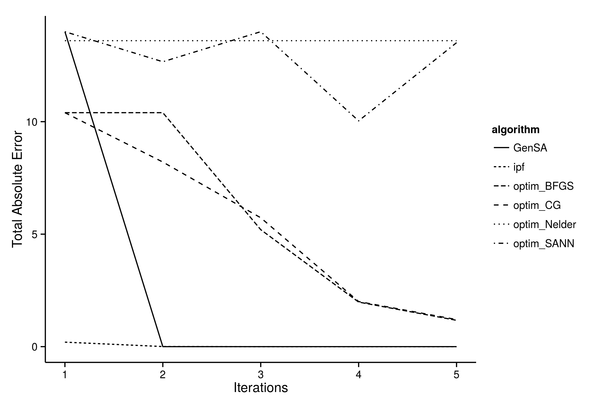

# Spatial microsimulation in R {#smsimr}

In this chapter we progress from loading and preparing the input data to
running a spatial microsimulation model.
The SimpleWorld data, loaded in the previous chapter,
is used. Being small and simple, the example enables understanding
the process on a 'human scale' and allows experimentation
without the worry of overloading your computer.
However, the methods apply equally to larger and more complex projects.
Therefore practicing the basic principles and methods of spatial microsimulation
in R is the focus of this chapter.
Time spent mastering these basics will make subsequent steps
much easier.

```{r, echo=FALSE}
# How representative each individual is of each zone is determined by their
# *weight* for that zone. If we have `nrow(cons)` zones and `nrow(ind)`
# individuals (3 and 5, respectively, in SimpleWorld) we will create
# 15 weights. Real world datasets (e.g. that presented in chapter xxx)
# could contain 10,000 individuals
# to be allocated to 500 zones, resulting in an unwieldy 5 million element
# weight matrix but we'll stick with the SimpleWorld dataset here for simplicity.
load("cache-data-prep.RData")
```

How representative each individual is of each zone is determined by their
*weight* for that zone. If we have `nrow(cons)` zones and `nrow(ind)`
individuals (3 and 5, respectively, in SimpleWorld) we will create
15 weights. To start, we create an empty weight matrix, ready to be filled
with numbers calculated through the IPF procedure:

```{r}
weights <- matrix(data = NA, nrow = nrow(ind), ncol = nrow(cons))
dim(weights) # dimension of weight matrix: 5 rows by 3 columns
```

## IPF in R {#IpfinR}

The most established *deterministic* method to allocate individuals to zones
is iterative proportional fitting (IPF). IPF involves calculating a series of
weights that represent how representative each individual is of each zone.
This is *reweighting*. The IPF algorithm can be written in
R from scratch, as illustrated in Lovelace (2014), and as implemented in the
smsim-course GitHub repository (https://github.com/Robinlovelace/spatial-microsim-book).
The code in this file, and the accompanying text, saves the weight
matrix after every constraint for each iteration. While this makes the
code relatively slow, it is useful for diagnosing issues with the reweighting
process. However, to save computer and researcher time, we will
skip directly to an alternative method that uses the **ipfp** package
in this section.

Regardless of which implementation of used,
IPF can be used to allocate the individual-level data loaded in
the previous chapter to the three zones of SimpleWorld. IPF is mature,
fast and has a long history.
Interested readers are directed towards recent papers (e.g. Lovelace and Ballas,
2012;
Pritchard and Miller,
2012)
for more detail on the method and its underlying theory.

```{r, echo=FALSE}
# Possibly more on IPF here. For now, press on
```

## Reweighting with **ipfp** {#ipfp}

IPF runs much faster and with less code using the
**ipfp** package than in pure R. The `ipfp` function runs the IPF algorithm
in the C language, taking aggregate constraints, individual level
data and and an initial weight vector (`x0`) as inputs:

```{r}
library(ipfp) # load ipfp library after install.packages("ipfp")
cons <- apply(cons, 2, as.numeric) # to 1d numeric data type
ipfp(cons[1,], t(ind_cat), x0 = rep(1, nrow(ind))) # run IPF
```

It is impressive that the entire IPF process, which takes dozens of lines of
code in pure R can been condensed into two lines: one to
convert the input constraint dataset to `numeric`^[The integer data type fails
because C requires `numeric` data to be converted into its *floating point*
data class.]
and one to perform the IPF operation itself. Note also that although
we did not specify how many iterations to run, the above command
ran the default of `maxit = 1000` iterations, despite convergence happening after
10 iterations. This can be seen by specifying the `maxit` and `verbose` arguments
(the latter of which can be referred to lazily as `v`) in `ipfp`, as illustrated below (only the first line of R output is shown):

```{r, eval=FALSE}
ipfp(cons[1,], t(ind_cat), rep(1, nrow(ind)), maxit = 20, v = T)
```

```
## iteration 0:   0.141421
## iteration 1:    0.00367328
## iteration 2:  9.54727e-05
## ...
## iteration 9:  4.96507e-16
## iteration 10:	4.96507e-16
```

Notice also that a *transposed* (via the `t()` function) version of the individual-level
data (`ind_cat`) is used in `ipfp`
to represent the individual-level data, instead of the
`ind_agg` object used in the pure R version. To prevent having to transpose
`ind_cat` every time `ipfp` is called, save the transposed version:

```{r}
ind_catt <- t(ind_cat) # save transposed version of ind_cat
```

Another object that can be saved prior to running `ipfp` on all zones
(the rows of `cons`) is `rep(1, nrow(ind))`, simply a series of ones - one for each individual.
We will call this object `x0` as its argument name representing
the starting point of the weight estimates in `ipfp`:

```{r}
x0 <- rep(1, nrow(ind)) # save the initial vector
```

To extend this process to all three zones we can wrap the line beginning
`ipfp(...)` inside a `for` loop, saving the results each time into the
weight variable we created earlier:

```{r}
weights_maxit_2 <- weights # create a copy of the weights object
for(i in 1:ncol(weights)){
  weights_maxit_2[,i] <- ipfp(cons[i,], ind_catt, x0, maxit = 2)
}
```

The above code uses `i` to iterate through the constraints, one row (zone) at
a time, saving the output vector of weights for the individuals into columns
of the weight matrix. To make this process even more concise (albeit
less clear to R beginners), we can use R's internal
`for` loop, `apply`:

```{r}
weights <- apply(cons, MARGIN = 1, FUN = 
    function(x) ipfp(x, ind_catt, x0, maxit = 20))
```

In the above code R iterates through each row
(hence the second argument `MARGIN` being `1`, `MARGIN = 2`
would signify column-wise iteration).
Thus `ipfp` is applied to each zone in turn, as with the `for` loop implementation. 
The speed savings of writing the function 
with different configurations are benchmarked in
'parallel-ipfp.R' in the 'R' folder of the book project directory.
This shows that reducing the maximum iterations of `ipfp` from
the default 1000 to 20 has the greatest performance benefit.^[These
tests also show that any speed gains from using `apply` instead of `for` are negligible, so
whether to use `for` or `apply` can be decided by personal preference.]
To make the code run faster on large datasets, a parallel version of
`apply` called `parApply` can be used. This is also
tested in 'parallel-ipfp.R'.

```{r, echo=FALSE, eval=FALSE}
# Also discuss what happens when you get a huge dataset, from Stephen's dataset
```

It is important to check that the weights obtained from IPF make sense.
To do this, we multiply the weights of each individual by rows of
the `ind_cat` matrix, for each zone. Again, this can be done using
a for loop, but the apply method is more concise:

```{r}
ind_agg <- t(apply(weights, 2, function(x) colSums(x * ind_cat)))
colnames(ind_agg) <- colnames(cons) # make the column names equal
```

As a preliminary test of fit,
it makes sense to check a sample of the aggregated weighted data
(`ind_agg`) against the same sample of the constraints.
Let's look at the results (one would use a subset of the results, 
e.g. `ind_agg[1:3, 1:5] for the first five values of the first 3
zones for larger constraint tables found in the real world):

```{r}
ind_agg
cons
```

This is a good result: the constraints perfectly match the results
generated using ipf, at least for the sample. To check that this
is due to the `ipfp` algorithm improving the weights with each iteration,
let us analyse the aggregate results generated from the alternative
set of weights, generated with only 3 iterations of IPF:

```{r}
# Update ind_agg values, keeping col names (note '[]')
ind_agg[] <- t(apply(weights_maxit_2, MARGIN = 2, 
  FUN = function(x) colSums(x * ind_cat)))
ind_agg[1:2, 1:3]
```

Clearly the final weights after 3 iterations of IPF represent the constraint
variables well, but do not match perfectly except in the second constraint. This shows the importance of
considering number of iterations in the reweighting stage --- too many iterations
can be wasteful, too few may result in poor results. To reiterate,
20 iterations of IPF should be sufficient in most cases for the results
to converge towards their final level of fit. 
More sophisticated ways of evaluating model fit are
presented in Section \ref{svalidation}.

## Alternative reweighting algorithms {#alternative-reweighting}

As described in the Introduction, IPF is just one strategy for obtaining
a spatial microdataset. However, researchers (myself included) have tended to
select one method that they are comfortable and stick with that for their models.
This is understandable because setting-up the method is usually time consuming:
most researchers rightly focus on applying the methods to the real world rather
than fretting about the details. On the other hand, if alternative methods
work better for a particular application, resistance to change can result
in poor model fit. In the case of very large datasets, spatial microsimulation
may not be possible unless certain methods, optimised to deal with large
datasets, are used. Above all, there is no consensus about which methods
are 'best' for different applications, so it is worth experimenting to identify
which method is most suitable for each application.

### The GREGWT algorithm

An interesting alternative to the IPF method is the GREGWT algorithm. An
implementation of this algorithm in the SAS language currently exists. This
macros was developed by the Statistical Service area of the Australian Bureau
of Statistics (ABS). The algorithm reweighs a set of initial weights using a
Generalized Regression Weighting (GREG) procedure. The generated new weights
match the given small areas benchmark constraints. A problem with this
approach is that the geneated weights produced by GREG do not have any
restrictions, this leads to the generation of negative weights. The macros
developed by ABS adds a weight restriction in their GREGWT macros. The ABS uses
the Linear Truncated Method described in Singh and Mohl (1996) to enforce these
restrictions.

A clear simplified example of this algorithm (and other algorithms) can be
found in Rahman (2009).  In their paper Tanton et.al (2011) make a full
description of the algorithm. For a deeper understanding of the SAS macros see
Bell (1999).


```{r, echo=FALSE}
# TODO: deal with the bib
# Sorry I don't know how you are dealing with references, so I add the .bib
# here
# I also the formated references in ./references.Rmd

# .bib
# @article{SinghMohl.96,
# 	author = {Singh, A and Mohl, C},
# 	journal = {Survey Methodology},
# 	pages = {107–115},
# 	title = {{Understanding calibration estimators in survey sampling}},
# 	volume = {22},
# 	year = {1996}
# }
#
# @InCollection{Rahman.2009,
#   Title = {Small Area Estimation Through Spatial Microsimulation Models},
#   Author = {Rahman, Azizurr},
#   Booktitle = {2nd International Microsimulation Association Conference},
#   Year = {2009},
#   Address = {Ottawa and Canada},
# }
#
# @TechReport{Bell.1999,
#   Title = {Weighting and Standard Error Estimation for ABS Household Surveys
#            (Paper prepared for ABS Methodology Advisory Committee)},
#   Author = {Bell, Philip},
#   Institution = {ABS},
#   Year = {1999},
#   Organization = {ABS}
# }
#
# @Article{Tanton.2011,
#   Title = {Small area estimation using a reweighting
#            algorithm},
#   Author = {Tanton, Robert and Vidyattama, Yogi and Nepal, Binod and
#             McNamara, Justine},
#   Journal = {Journal of the Royal Statistical Society: Series A (Statistics in
#                                                                  Society)},
#   Year = {2011},
#   Number = {4},
#   Pages = {931--951},
#   Volume = {174},
#   Doi = {10.1111/j.1467-985X.2011.00690.x}
# }

# plain
# Bell, P. (1999). Weighting and Standard Error Estimation for ABS Household Surveys
#   (Paper prepared for ABS Methodology Advisory Committee) ABS.
# Rahman, A. (2009). Small Area Estimation Through Spatial Microsimulation
#   Models. In 2nd International Microsimulation Association Conference.
#   Ottawa, Canada.
# Singh, A, Mohl, C. (1996). Understanding calibration estimators in survey
#   sampling, Survey Methodology 22, 107-115.
# Tanton, R., Vidyattama, Y., Nepal, B. & McNamara, J. (2011). Small area
#   estimation using a reweighting algorithm Journal of the Royal Statistical
#   Society: Series A (Statistics in Society), 174, 931-951

```

### Spatial microsimulation as an objective function

In general terms, an *objective function* is a formula that processes a series of
input variables ($x$) using a number of parameters ($par$) to generate
a single numeric output:

$$ \mbox{minimise } f_0(x) $$

$$ \mbox{subject to } f_i(x) \leq par_i,\  i = 1, ..., m $$

The goal of objective function $f_0$ such as that illustrated above is to
enable the selection of the parameters $par_i$ to $par_m$
which minimize the result. The values that parameters may take are constrained
by *constraint functions* ($f_i$) or fixed values (Boyd and
Vandenberghe, 2009). The case of spatial microsimulation has relatively
simple constraints: they are all positive or zero.
Seeing spatial microsimulation as an objective function
allows solutions to be found using established
techniques of *constrained optimisation*.
The main advantage of this re-framing
is that it allows any optimisation algorithm to perform the reweighting.
Key to this is interpreting individual weights as parameters (the vector $par$,
of length $m$ above)
that are iteratively modified to optimise the fit between individual and
aggregate-level data. The measure of fit is we use in this context is
Total Absolute Error (TAE) and the objective function
is as follows:

$$\mbox{minimise }f(par) = TAE(sim, con)$$

$$\mbox{where }sim = colSums(ind\_cat * par) $$

$$\mbox{subject to } par \geq 0$$

```{r, echo=FALSE}
# how to write in maths?
# $$\mbox{minimise }f(par)$$
```


Note that in the above, $par$ is equivalent to the `weights` object
we have created in previous sections to represent how representative
each individual is of each zone. 
The main issue with this definition of reweighting is therefore the large
number of free parameters: equal to the number of individual-level dataset.
Clearly this can be very very large. To overcome this issue,
we must 'compress' the individual level dataset to its essence, to contain
only unique individuals with respect to the constraint variables
(*constraint-unique* individuals).

The challenge is to convert the binary 'model matrix' form of the
individual-level data (`ind_cat` in the previous examples) into
a new matrix (`ind_num`) that has fewer rows of data. Information about the
frequency of each constraint-unique individual is kept by increasing the
value of the '1' entries for each column for the replicated individuals
by the number of other individuals who share the same combination of attributes.
This may sound quite simple, so let's use the example of SimpleWorld to
illustrate the point.

### Reweighting with optim and GenSA

The base R function `optim` provides a general purpose optimisation framework
for numerically solving objective functions. Based on the objective function
for spatial microsimulation described above,
we can use any general optimisation algorithm for reweighting the
individual-level dataset. But which to use?

Different reweighting strategies are suitable in different contexts and there
is no clear winner for every occasion. However, testing a range of
strategy makes it clear that certain algorithms are more efficient than
others for spatial microsimulation. Figure x demonstrates this variability
by plotting total absolute error as a function of number of iterations for
various optimisation algorithms available from the base function
`optim` and the **GenSA** package.



```{r, eval=FALSE, echo=FALSE, message=FALSE, warning=FALSE}
source("R/optim-tests-SimpleWorld.R", echo = FALSE, print.eval = FALSE )
qplot(data = opt_res, time, fit, color = algorithm, geom="line") +
  ylab("Total Absolute Error") + xlab("Time (microseconds)") + scale_color_brewer(palette = 2, type = "qual") + theme_classic() + xlim(c(0, 15000))
```

Figure x shows the advantage of the IPF algorithm we have been using, which
converges rapidly to zero error after only a few iterations.
On the other end of the spectrum is R's default optimisation algorithm,
the Nelder-Mead method. Although the graph shows no improvement
from one iteration to the next, it should be stated that the algorithm
is just 'warming up' at this stage and than each iteration is very
fast, as we shall see. After a few *hundred* iterations (which happen
in the same time that other algorithms take for a single iteration),
the Nelder-Mead method is effective,
converging to close to zero in 400 iterations, taking far more
iterations to converge to a value approximating zero than IPF.
Next best in terms of iterations is `GenSA`, the Generalized Simulated
Annealing Function from the **GenSA** package. GenSA
attained a near-perfect fit after only two full
iterations.

The remaining algorithms shown are, like Nelder-Mead, available from within R's
default optimisation function `optim`. The implementations with `method =` set
to `"BFGS"` (short for the Broyden–Fletcher–Goldfarb–Shanno algorithm),
`"CG"` ('conjugate gradients') performed roughly the same, steadily approaching
but not reaching zero error after five iterations. Finally, the `SANN` method,
also available in `optim`, performed most erratically of the methods tested.
This is another implementation of simulated annealing which demonstrates that
optimisiation functions that depend on random numbers do not always lead to
improved fit from one iteration to the next.

The code used to test these alternative methods for reweighting are provided
in the script 'R/optim-tests-SimpleWorld.R'. The results
should be reproducible on
any computer, provided the book's supplementary materials have been downloaded.
There are many other optimisation algorithms available in R through a wide
range of packages; new and improved functions are available all the time
so enthusiastic readers are encouraged to experiment with this script files:
it is perfectly feasible that an algorithm exists which outperforms all of
those tested for this book. Also, it should be noted that the algorithms
were tested on the extremely simple and rather contrived example dataset
of SimpleWorld. Some algorithms perform better with larger datasets than others
and the results can be highly sensitive to changes to the initial conditions
such as the problem of 'empty cells'.

```{r, echo=FALSE}
# TODO: cite performance testing paper here
```

Therefore these results, as with any modelling exercise,
should be interpreted with a healthy dose of skepticism: just because an
algorithm converges after few 'iterations' this does not mean it is
inherently any faster or more useful than another. The results are context
specific, so it is recommended that the tested framework
in 'R/optim-tests-SimpleWorld.R' is used as a basis for further tests
on algorithm performance on the datasets you are using.
IPF has performed well in the situations I have tested it in (especially
via the `ipfp` function, which performs disproportionately faster
than the pure R implementation on large datasets) but this does not mean
that it is always the best approach.

To overcome the caveat that the meaning of an 'iteration' changes dramatically
from one algorithm to the next, further tests measured the time taken
for each reweighting algorithm to run. The results are very different when
iterations are seen as the independent variable (Figure xx). This figure
Demonstrates that Nelder-Mead is fast at reaching a good
approximation of the constraint data, despite taking many iterations.
`GenSA`, on the other hand, is shown to be much slower than the others,
despite only requiring 2 iterations to arrive at a good level of fit.
The `SANN` method is not shown at all due to high TAE values for all
times shown.


### Combinatorial optimisation

Combinatorial optimisation is an alternative to IPF for allocating individuals
to zones. This strategy is *probabilistic*
and results in integer weights, as opposed to the fractional weights
generated by IPF. Combinatorial optimisation may be more appropriate
for applications where input individual microdatasets are very large:
the speed benefits of using the deterministic IPF algorithm shrink as the size of
the survey dataset increases. An alternative to combinatorial optimisation,
which builds on the fractional weights generated through IPF
(or any other method of reweighting), is *intersation*.
Integerisation largely reduces the need for combinatorial optimisation,
as we shall see in the next section (\ref{sintegerisation}).

There are two approaches for reweighting using combinatorial optimisation
in R: shuffling individuals in and out of each area and combinatorial optimisation
the *domain* of the solution space set to allow inter-only results...

The second approach to combinatorial optimisation in R depends on methods
that allow only integer solutions to the general constrained optimisation
formulae demonstrated in the previous section. *Integer programming* is the
branch of computer science dedicated to this area, and it is associated with
its own algorithms and approaches, some of which have been implemented in R
(Zubizarreta, 2012).

To illustrate how the approach works in general terms, we can use the
`data.type.int` argument of the `genoud` function in the **rgenoud** package.
This ensures only integer results for
a genetic algorithm to select parameters are selected:

```{r, eval=FALSE}
# Set min and maximum values of constraints with 'Domains'
m <- matrix(c(0, 100), ncol = 2)[rep(1, nrow(indu)),]
set.seed(2014)
genoud(nrow(indu), fn = fun, ind_num = indu, con = cons[1,],
  control = list(maxit = 1000), data.type.int = TRUE, D = m)
```

This rather long command, implemented in 'optim-tests-SimpleWorld.R',
results in weights for the unique individuals 1 to 4 of 1, 4, 2 and 4 respectively.
This means that a total population of 11 individuals is simulated for the zone,
composed of 1 instance of individual 1 and 'clone' of the others.
The command takes 5 seconds to generate
an incorrect result, so this implementation of `genoud`
is clearly not production ready.
`genoud` is used here only
to provide a practical demonstration of the possibilities of
combinatorial optimisation using existing R packages.

For combinatorial optimisation algorithms designed for spatial microsimulation
we must, for now, look for programs outside the R 'ecosystem'.
Harland (2013) provides a practical tutorial
introducing the subject based on the Flexible Modelling Framework (FMF)
Java program. It is possible to generate integer spatial microdata using IPF, however,
using a technique we refer to imaginatively as integerisation.
This is the topic of the next section.

## Integerisation {#sintegerisation}

Integerisation is the process by which a vector of real numbers
is converted into a vector of integers corresponding to the
individuals present in synthetic spatial microdata.
The length of the new vector must equal the population of the zone
in question and individuals with high weights must be sampled
proportionally more frequently than those with
low weights for the operation to be effective.
The following example illustrates how the process,
when seen as a function called $int$ would work
on a vector of 3 weights:

$$w_1 = (0.333, 0.667, 3)$$

$$int(w_1) = (2, 3, 3, 3)$$

This result was obtained by calculating the sum of the weights (4, which
represents the total population of the zone) and sampling from these
until the total population is reached. In this case individual 2 is selected
once as they have a weight approaching 1, individual 3 was replicated
(*cloned*) three times and individual 1 does not appear in the integerised
dataset at all, as it has a low weight. In this case the outcome is straightforward
because the numbers are small and simple. But what about in less clear-cut cases,
such as $w_2 = (1.333, 1.333, 1.333)$? What is needed is an algorithm to undertake this
process of *integerisation* in a systematic way to maximise the fit between
the synthetic and constraint data for each zone.

In fact there are a number of integerisation strategies available.
Lovelace and Ballas (2012) tested 5 of these and found that probabilistic
integerisation methods consistently outperformed deterministic rivals.
The details of these algorithms are described in the aforementioned paper
and code is provided in the Supplementary Information. For the purposes of
this course we will create a function to undertake the simplest of these,
*proportional probabilities*:

```{r}
int_pp <- function(x){
  sample(length(x), size = round(sum(x)), prob = x, replace = T)
}
```

To test this function let's try it on the vectors of length 3 described in
code:

```{r}
set.seed(0)
int_pp(x = c(0.333, 0.667, 3))
int_pp(x = c(1.333, 1.333, 1.333))
```

The first result was the same as that obtained through intuition; the second
result represented individual 1 being clones three times, plus one instance of individual 2. This is
not intuitive: one would expect at least one of each individual given that they all
have the same weight.

It is important to emphasise that the results will change each time the code is
run, because `sample` is a probabilistic (its output depends on a random number
generator): changing the value inside the brackets proceeding `set.seed`
results in many other combinations of individuals being selected --- test this
out in your code.  This happens because the method relies on *pseudo random
numbers* to select values probabilistically and `set.seed` specifies where the
random number sequence should begin, ensuring repeat-ability. An issue with the
*proportional probabilities* (PP) strategy is that completely unrepresentative
combinations of individuals have a non-zero probability of being sampled: the
method will output $(1, 1, 1, 1)$ once in every 21 thousand runs for $w_1$ and
once every $81$ runs for $w_2$, the same probability as for all other 81 ($3^4$)
permutations.

To overcome this issue Lovelace and Ballas (2012) developed a method which
ensures that any individual with a weight above 1 would be sampled at least once,
making the result $(1, 1, 1, 1)$ impossible in both cases.  This method is
*truncate, replicate, sample* (TRS) integerisation:

```{r}
int_trs <- function(x){
  truncated <- which(x >= 1)
  replicated <- rep(truncated, floor(x[truncated]))
  r <- x - floor(x)
  def <- round(sum(x)) - length(replicated) # deficit population
  if(def == 0){
    out <- replicated
  } else {
    out <- c(replicated,
      sample(length(x), size = def, prob = r, replace = FALSE))
  }
  out
}
```

To see how this new integerisation method and associated R function
performed, we will run it on the same input vectors:

```{r}
int_trs(c(0.333, 0.667, 3))
int_trs(c(1.333, 1.333, 1.333))
```

The range of possible outcomes is smaller using the TRS technique; the fit
between the resulting microdata and the aggregate constraints will tend to be
higher. Thus we use the TRS methodology, implemented through the function
`int_trs`, for integerising the weights generated by IPF throughout the majority
of this book.

Let's use TRS to
generate spatial microdata for SimpleWorld.  Remember, we already have generated
the weight matrix `weights`.  The only challenge is to save the vector of
sampled individual id numbers, alongside the zone number, into a single object
from which the attributes of these individuals can be recovered. Two strategies
for doing this are presented in the code below:

```{r}
# Method 1: using a for loop
ints_df <- NULL
for(i in 1:nrow(cons)){
  ints <- int_trs(weights[, i])
  ints_df <- rbind(ints_df, data.frame(id = ints, zone = i))
}

# Method 2: using apply
ints <- unlist(apply(weights, 2, int_trs)) # integerised result
ints_df <- data.frame(id = ints,
  zone = rep(1:nrow(cons), colSums(weights)))
```

Both methods yield the same result for `ints_df`. The only differences being
that Method 1 is perhaps more explicit and easier to understand whilst Method 2
is more concise.

The final remaining step is to re-allocate the attribute data from the
individual-level data back into `ints_df`. To do this we use the `inner_join`
function from the recently released **dplyr** package.^[The functions `merge`
from the R's base package and `join` from the **plyr** provide other ways of
undertaking this step. `inner_join` is used in place of `merge` because `merge`
does not maintain row order.  `join` generates the same result, but is slower,
hence the use of `inner_join` from the recently released and powerful **dplyr**
package.]
 Assuming **dplyr** is loaded --- with `library(plyr)`
--- one can read more about join by entering `?inner_join` in R.

```{r, message=FALSE}
ind_full <- read.csv("data/SimpleWorld/ind-full.csv")
library(dplyr) # use install.packages(dplyr) if not installed
ints_df <- inner_join(ints_df, ind_full)
```

`ints_df` represents the final spatial microdataset, representing the entirety
of SimpleWorld's population of 33 (this can be confirmed with `nrow(ints_df)`).
To select individuals from one zone only is simple using R's subsetting
notation. To select all individuals generated for zone 2, for example, the
following code is used. Note that this is the same as the output generated in
Table 5 at the end of the SimpleWorld chapter --- we have successfully modelled
the inhabitants of a fictional planet, including income!

```{r}
ints_df[ints_df$zone == 2, ]
```

```{r, echo=FALSE}
# library(knitr)
# kable(ints_df[ints_df$zone == 2,], row.names = FALSE)
```
